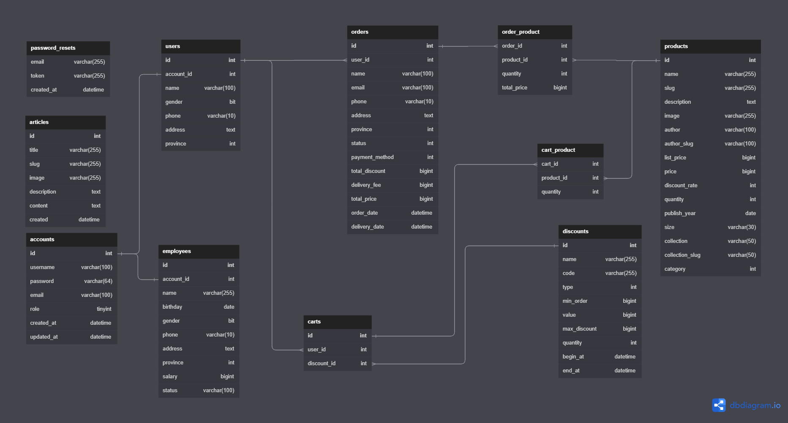

# Cửa hàng truyện tranh Sâu kiu
## Mô tả đồ án
Xây dựng trang web mà khách hàng có thể ghé thăm và mua các thể loại truyện trang đang được bày bán trên thị trường.

Xem demo tại [đây](https://drive.google.com/file/d/1j9Prz16Ik6qrcdqLKyakuXrdUgcAitDr/view?usp=drive_link)
## Thành viên trong nhóm
| **STT** |        **Họ tên**       |                 **Nhiệm vụ**                | **Đóng góp** |
|:-------|:-----------------------|:-------------------------------------------|:------------:|
| 1       | Lương Nguyễn Thành Nhân | Trưởng nhóm, Backend, Thiết kế usecase, ERD | 60%          |
| 2       | Trương Ý Nhi            | Frontend                                    | 20%          |
| 3       | Lâm Võ Khánh My         | Thiết kế giao diện, hỗ trợ Frontend         | 20%          |

## Lưu ý 
- Cần cài đặt thêm web server Go để sử dụng được chức năng Firebase Storage. [Xem tại đây](https://github.com/LNThanhNhan/FirebaseGo)

## Những thứ đã học được
- Framework Laravel 9
- Chat bằng Messenger Facebook
- Validation
- AJAX/API
- reCAPTCHA V3
- Firebase Storage
## Các tính năng đã thực hiện được
- Có 3 loại user: Khách hàng, quản lý, nhân viên
- Đọc thêm các bài viết về các chương trình trong cửa hàng
- Quản lý khách hàng, sản phẩm, nhân viên cửa hàng
- Hoàn thiện quy trình mua hàng của khách hàng
- Hoàn thiện quy trình xử lý cửa hàng dành cho nhân viên
- Đăng ký, đăng nhập bằng email cơ bản
- Thống kê được top 10 sản phẩm bán chạy
## Sơ đồ ERD

## Khó khăn 
- Đồ án này còn có rất nhiều thiếu sót cùng với các tính năng nên có như: 
1. OAuth bằng các tài khoản mạng xã hội (Google, Facebook,v.v..)
2. Có thêm phương thức thanh toán khác (trong tương lai sẽ thêm thanh toán bằng VNPay)

## Tài liệu tiếng việt 
Tài liệu tiếng việc về project có thể đọc [tại đây](https://drive.google.com/file/d/1SuEmQca5XV2eoKRPsDE2wHOaWO2tqK_l/view?usp=sharing)
